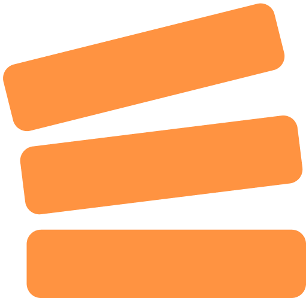

# Overflows
<div align=center>


[](https://github.com/UncleChair/Overflows/blob/main/LICENSE)

</div>

Overflows is a light weight job scheduler for your work, help you manage your task with orders.

# Stacks

- Frontend
  - [Vue3](https://vuejs.org/)
  - [Vuetify](https://vuetifyjs.com/)
- Backend
  - [Go](https://go.dev/)
  - [GoFrame](https://goframe.org/)
  - [PostgreSQL](https://www.postgresql.org/)
  - [SQLite](https://www.sqlite.org/)
  - [Atlas](https://atlasgo.io/)

# Usage

## Use Release

## Build from Source

### Frontend

Frontend is using Vue3 and Vuetify. Build frontend like a normal vue project.

``` bash
cd frontend
npm install
npm run build
```

The default output directory is in `backend` folder, you can change it to your own directory if you don't need to build the backend with `standalone` mode.

### Backend

The language used in backend is `Go`, and the overall framework is `GoFrame`. To enable `standalone` mode, we also introduce [systray](https://github.com/getlantern/systray) to build a tray app for you. For database schema management, we use [Atlas](https://atlasgo.io/) to manage and apply migrations, if you want to use other tools, you could also find the original tables in `backend/manifest/database` folder.

To build the backend, you need to install `Go` and `GoFrame Cli tool` first.

``` bash
go install github.com/gogf/gf/cmd/gf/v2@latest
```

And then change the configuration file in `backend/manifest/config/`. You can find example configurations there, choose or modify one and change its name to `config.yaml`. The configuration file would be built into the binary by default, if you don't want it, you can change the build configuration in `hack/config.yaml` and setup a configuration file in where the built binary file is used, the binary file would read from that automatically.

Linux and windows have some different build configurations, you need to choose it in `hack/config.yaml`. After that, you can use `gf` to build the backend.

``` bash
cd backend
gf build
```

You will find the binary file in `backend/temp` folder.

Databases used for this project are SQLite and PostgreSQL. The `standalone` mode would use SQLite as database and basically you don't need to manage it manually. If you want to use `server` mode, you need to prepare a PostgreSQL server with the same settings in `config.yaml` or set your own database and change the configuration.
- Default database: `overflows`
- Default user: `overflower`
- Default password: `Passw0rd`

Then you can install `atlas` and use it to manage and apply migrations, if you are not using the default database, you may also need to change the `backend/atlas.hcl` file.

``` bash
cd backend
atlas migrate apply --env local
```

# Development

- When using `standalone` mode locally, build the static files package by running `gf build` in `backend` folder with the same process like `gf build` do. Otherwise, file manager can not get migration files.

# TODO LIST

## Backend TODO

- [ ] Selfhost mode with SQLite
- [ ] Server mode with Postgre or Mysql
- [ ] Casbin RBAC
- [ ] Token login and session login
- [ ] Stack sharing

## Frontend TODO

- [ ] Login page
- [ ] User list page
- [ ] Own page
- [ ] Admin setting page

